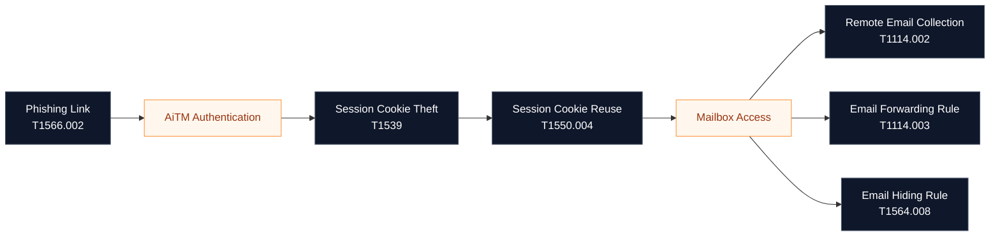
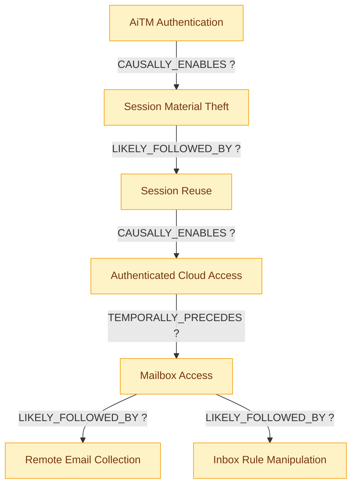
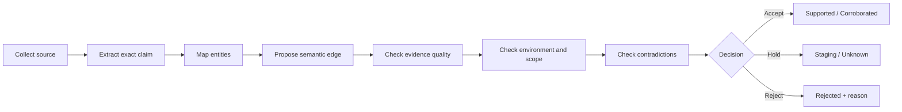

<div align="center">

# 🔐 VS-001

## AiTM Token Theft → Mailbox Manipulation

### An evidence-backed investigation of Microsoft 365 session compromise

<br>

[](#-current-progress)
[](#)
[](#)
[](#)
[](#-trust-boundary)

<br>

> ### Security tools detect individual events.  
> ### This vertical slice investigates the behavioral relationships between them.

</div>

---

## 🧭 Overview

A user is directed to an adversary-in-the-middle phishing page that proxies the legitimate Microsoft sign-in experience.

The user enters valid credentials and completes MFA. The attacker captures the authenticated session material, reuses it to access Microsoft 365, opens Exchange Online, collects email, and may create mailbox rules to hide, delete, or forward messages.

The individual behaviors are already documented across ATT&CK, threat reports, product alerts, and audit logs.

The unresolved question is whether they can be represented as **one validated, queryable behavioral model** that helps an investigator answer:

- What is likely to happen next?
- What evidence supports that prediction?
- Which telemetry can confirm or reject it?
- Which stages are detected?
- Where does behavioral-chain coverage break?

---

## 🧩 Attack sequence under study



> **Important:** The diagram is a research model—not a claim that every AiTM compromise follows this exact path.

---

## 🎯 Core research question

> **When a stolen Microsoft 365 session is reused, what behaviors are likely to follow, what evidence supports those relationships, and do existing detections cover the complete progression rather than only isolated stages?**

---

## 🔎 The suspected gap

| What exists today | What still requires investigation |
|---|---|
| ATT&CK describes individual adversary techniques | Which techniques are behaviorally connected in this scenario |
| Microsoft security products may alert on isolated activities | Whether the alerts form one defensible attack progression |
| CTI reports describe real campaigns | How to convert narrative observations into reusable relationships |
| Audit logs expose mailbox and identity activity | Which evidence confirms or disproves each transition |
| Detection rules map to behaviors | Whether the complete chain has full, partial, weak, or no coverage |
| Experienced analysts connect the evidence mentally | How to preserve that reasoning as validated knowledge |

---

## 💡 Research hypothesis

> Cybersecurity has strong taxonomies, telemetry, detections, and threat reports, but lacks a continuously validated knowledge layer that connects:
>
> **attacker behavior → semantic relationships → evidence → telemetry → detection coverage → investigation action**

This vertical slice exists to test that hypothesis—not to assume it is true.

---

## 🧠 What this slice must prove

| Capability | Proof required |
|---|---|
| **Behavioral modeling** | Represent meaningful connections between isolated attack behaviors |
| **Semantic precision** | Distinguish causal, temporal, prerequisite, and probabilistic relationships |
| **Evidence grounding** | Trace every accepted relationship to reviewed source material |
| **Telemetry mapping** | Identify which logs can confirm or reject each transition |
| **Coverage reasoning** | Evaluate the sequence as a whole, not only individual rules |
| **Operational usefulness** | Produce an answer that improves a detection engineer's decision |
| **Trust** | Keep verified knowledge, hypotheses, unknowns, and rejected claims separate |

---

## 🧱 Trust boundary

The following labels are mandatory throughout this vertical slice:

| Label | Meaning |
|---|---|
| `SOURCE IDENTIFIED` | A potentially useful source has been collected but not fully reviewed |
| `HYPOTHESIS` | A proposed relationship that has not been accepted as graph knowledge |
| `SUPPORTED` | At least one reviewed source supports the claim |
| `CORROBORATED` | Multiple sufficiently independent sources support the claim |
| `CONFLICTED` | Reliable sources or practitioner feedback disagree |
| `REJECTED` | The claim failed validation or was found to be misleading |
| `UNKNOWN` | Evidence is currently insufficient |

> **No LLM-generated relationship becomes trusted knowledge without evidence and validation.**

---

## 📦 Scope

### Included

1. Phishing link delivery
2. AiTM-proxied authentication
3. Session-cookie or session-token theft
4. Reuse of authenticated session material
5. Microsoft 365 and Exchange Online access
6. Remote email collection
7. Inbox-rule creation, forwarding, deletion, or hiding
8. Candidate telemetry and detection-coverage analysis
9. Practitioner review of the behavioral model

### Excluded for VS-001

- Wire-transfer or payroll fraud
- Large-scale internal phishing propagation
- OAuth application abuse
- Endpoint malware
- Privilege escalation
- Cross-tenant compromise
- Automated internet-wide CTI ingestion
- Autonomous remediation

---

## 🔗 Candidate semantic relationships



The question mark is intentional. Each edge remains a hypothesis until the evidence register and practitioner review justify a stronger status.

---

## 🧪 Validation method



A relationship is reviewed against:

1. Source authority and independence
2. Whether the behavior was directly observed or inferred
3. Environmental applicability
4. Semantic correctness of the relationship type
5. Confidence and sample-size limitations
6. Conflicting evidence
7. Detection-engineer feedback

---

## 🛰️ Expected system output

The final vertical slice should support an answer shaped like this:

```text
Observed:
A potentially stolen Microsoft 365 session was reused.

Behavioral assessment:
Validated evidence indicates that authenticated mailbox access and
email collection are plausible follow-on behaviors in this scenario.

Coverage assessment:
Session misuse is detected, but correlation with subsequent mailbox
activity is partial or absent.

Evidence to collect next:
- Identity sign-in and session-risk events
- Exchange mailbox access activity
- New or modified inbox rules
- External forwarding configuration
- Message deletion, hiding, or unusual send activity

Conclusion:
State the supported hypothesis, confidence, evidence references,
coverage gaps, missing telemetry, and alternative explanations.
```

This is an **output contract**, not a pre-written conclusion.

---

## 📚 Research workspace

| Document | Purpose | Status |
|---|---|---:|
| [Attack Chain](attack-chain.md) | Defines the scenario, boundaries, entities, and candidate ATT&CK mapping | 🟡 Draft |
| [Semantic Gaps](semantic-gaps.md) | Records missing sequence, temporal, causal, environmental, and coverage knowledge | 🟡 Draft |
| [Evidence Register](evidence.md) | Tracks sources, exact supported claims, limitations, and validation state | 🟡 Sources identified |
| [Telemetry & Coverage](telemetry-and-coverage.md) | Maps behaviors to visibility, detections, correlations, and gaps | ⚪ Pending validation |
| [Practitioner Feedback](feedback-log.md) | Captures criticism, corrections, disagreements, and resulting changes | ⚪ Awaiting review |

---

## 🚦 Current progress

- [x] Select the first attack scenario
- [x] Define the initial scope boundary
- [x] Draft the behavioral sequence
- [x] Create candidate ATT&CK mappings
- [x] Identify initial authoritative sources
- [ ] Review every source and extract exact claims
- [ ] Validate each ATT&CK mapping
- [ ] Define evidence-backed semantic edges
- [ ] Validate telemetry requirements
- [ ] Map Microsoft Sentinel and Defender coverage
- [ ] Review the model with detection engineers
- [ ] Record disagreements and revise the model
- [ ] Build the deterministic graph query
- [ ] Compare the output against the current investigation workflow
- [ ] Publish findings and limitations

---

## 🗣️ Practitioner review question

> **Does this model reflect how an AiTM-driven Microsoft 365 compromise unfolds in real investigations—or does it overstate the predictability and correlation between the stages?**

The most valuable feedback is not agreement. It is:

- a missing behavior,
- an incorrect relationship,
- an environment-specific exception,
- an existing tool that already solves part of the problem,
- or evidence that the hypothesis itself is wrong.

---

## 🧭 Definition of done

VS-001 is complete only when:

- The attack boundary is clear.
- Every accepted semantic edge is evidence-backed.
- Uncertainty and conflicting evidence remain visible.
- Telemetry requirements are verified.
- Detection coverage is evaluated across the sequence.
- At least two experienced practitioners review the model.
- The final query produces a defensible answer with evidence and limitations.
- The output is compared with a normal investigation workflow.

---

<div align="center">

### Evidence before conclusions · Knowledge before AI

[Attack Chain →](attack-chain.md)

</div>
