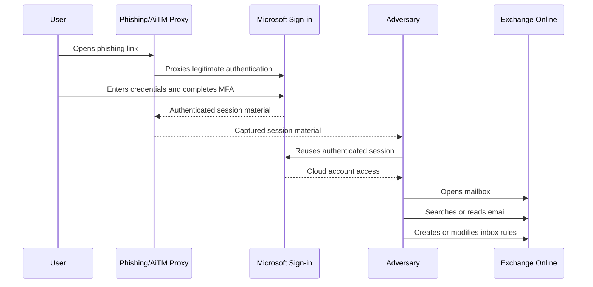
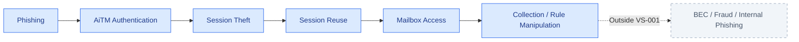
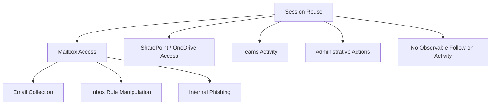

# 🔗 VS-001 · Attack Chain

> **Vertical Slice:** AiTM Token Theft → Mailbox Manipulation  
> **Status:** Research in progress  
> **Knowledge state:** Candidate model—relationships are not yet approved

[← Back to VS-001](README.md)

---

## 1. Scenario

A user receives a phishing message containing a link to infrastructure controlled by an adversary.

The link presents a proxied Microsoft sign-in experience. The user enters valid credentials and completes MFA. The adversary captures authenticated session material and reuses it to access the victim's Microsoft 365 account.

After authenticated access, the adversary may open Exchange Online, search or read email, configure forwarding, or create rules that hide or delete messages.

This vertical slice studies the path only up to mailbox manipulation.

---

## 2. Initial behavioral sequence

> This sequence illustrates the research scope. It does not imply that every campaign follows the same order or includes every stage.

---

## 3. Behavioral stages

| ID | Stage | Description | Current state |
|---|---|---|---|
| `B-001` | Phishing link delivered | User receives a message containing an adversary-controlled link | Candidate |
| `B-002` | Link opened | User navigates to the phishing infrastructure | Candidate |
| `B-003` | AiTM-proxied authentication | Authentication is relayed between the user and legitimate service | Candidate |
| `B-004` | Session material captured | Authenticated session cookie/token is obtained by the adversary | Candidate |
| `B-005` | Session material reused | The adversary authenticates using the stolen session | Candidate |
| `B-006` | Cloud account accessed | Microsoft 365 resources become accessible under the victim identity | Candidate |
| `B-007` | Mailbox accessed | Exchange Online is opened or queried | Candidate |
| `B-008` | Email collected | Messages are searched, read, downloaded, or synchronized | Candidate |
| `B-009` | Inbox rule manipulated | Rules are created or modified to forward, move, delete, mark, or hide email | Candidate |

---

## 4. Candidate ATT&CK mapping

| Behavior | Candidate mapping | Why it may apply | Validation |
|---|---|---|---|
| Phishing link delivery | `T1566.002` — Spearphishing Link | The user is directed to adversary-controlled infrastructure through a link | Source identified |
| Session material theft | `T1539` — Steal Web Session Cookie | Authenticated web-session material is captured | Source identified |
| Session material reuse | `T1550.004` — Web Session Cookie | Stolen session material is used to authenticate to a web service | Source identified |
| Remote mailbox collection | `T1114.002` — Remote Email Collection | Email is accessed from Microsoft 365 or Exchange Online | Source identified |
| Forwarding rule creation | `T1114.003` — Email Forwarding Rule | Mailbox rules are used to forward messages | Source identified |
| Deletion or concealment rule | `T1564.008` — Email Hiding Rules | Rules may move, delete, or hide security-relevant messages | Source identified |

### Mapping caution

`AiTM-proxied authentication` is an important behavior in this scenario, but the final ATT&CK representation must be validated carefully. A broad technique label should not be forced onto the behavior merely because the terminology appears similar.

---

## 5. Scope boundary

### Included

- Initial phishing link
- AiTM authentication flow
- Theft and reuse of session material
- Microsoft 365 access
- Exchange Online mailbox activity
- Email collection
- Inbox rule creation or modification

### Outside the first slice

- Financial fraud
- Payroll redirection
- Large-scale internal phishing
- OAuth-consent abuse
- Endpoint compromise
- Privilege escalation
- Cross-tenant activity
- Long-term persistence beyond mailbox rules

---

## 6. Branches that must not be ignored

The model must allow alternative outcomes after session reuse:

Only the mailbox branch is implemented in VS-001. The other branches remain visible so the slice does not falsely present a single deterministic progression.

---

## 7. Open questions

1. Which stage should be treated as the first reliable observation?
2. Is session theft directly observable, or usually inferred from later session use?
3. Which behaviors are prerequisites and which are merely common successors?
4. Does mailbox access always leave usable audit evidence?
5. How should native-client activity be represented compared with browser access?
6. Which parts of the chain depend on licensing, audit configuration, or retention?
7. What benign activity could produce a similar sequence?
8. Which alternative branches are important enough to include in the final model?

---

## 8. Acceptance criteria

This attack-chain document is ready for implementation only when:

- [ ] Every stage has a precise definition.
- [ ] ATT&CK mappings are reviewed against official technique descriptions.
- [ ] Alternative branches and benign explanations are documented.
- [ ] The first and last observation boundaries are unambiguous.
- [ ] Practitioners confirm the sequence is operationally realistic.
- [ ] Unsupported ordering assumptions are removed or explicitly labeled.

---

## Navigation

[← Back to VS-001](README.md) ·
[Semantic Gaps →](semantic-gaps.md)
