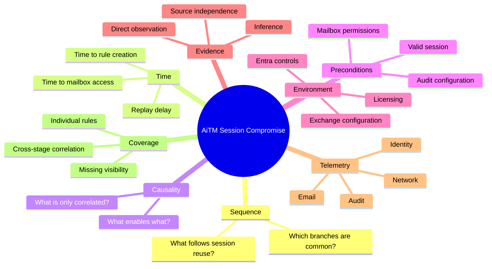
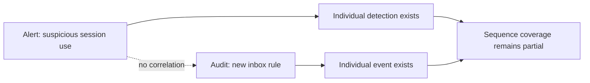

# 🧠 VS-001 · Semantic Gaps

> **Vertical Slice:** AiTM Token Theft → Mailbox Manipulation  
> **Purpose:** Identify what remains unknown after listing the individual techniques  
> **Status:** Hypothesis mapping

[← Attack Chain](attack-chain.md) · [Back to VS-001](README.md)

---

## Why this document exists

A technique list can identify the behaviors present in an attack.

It does not automatically explain:

- how the behaviors relate,
- whether one action enabled another,
- which action usually follows,
- how much time separates them,
- which conditions must exist,
- which evidence proves the transition,
- or whether detection coverage exists across the complete progression.

This document records those missing semantics without pretending they are already solved.

---

## Gap map



---

## 1. Sequence gap

### Questions

- Which behavior commonly follows stolen-session reuse?
- Does mailbox access normally precede email collection?
- How often does inbox-rule manipulation occur?
- Which branches are common, rare, or campaign-specific?
- Can the sequence begin from an already stolen cookie without observed phishing?

### Risk of getting it wrong

A visually plausible sequence may be mistaken for a statistically common sequence even when it is supported by only one published campaign.

### Required evidence

- Multiple incident or campaign observations
- Clear timestamps or ordered narrative
- Explicit distinction between observed and inferred ordering
- Environment and victim context

---

## 2. Temporal gap

### Questions

- How quickly is a stolen session typically reused?
- How soon after session reuse does mailbox access occur?
- How much time passes before forwarding or hiding rules are created?
- Do attackers pause to reduce detection risk?
- How does token lifetime affect the usable attack window?

### Proposed representation

```yaml
temporal:
  relationship: TEMPORALLY_PRECEDES
  observed_min: unknown
  observed_max: unknown
  median: unknown
  sample_size: 0
  unit: minutes
  status: UNKNOWN
```

### Guardrail

No timing range should be published merely because a single incident contains timestamps.

---

## 3. Causality gap

The following relationships may look similar but mean different things:

| Relationship | Meaning |
|---|---|
| `CAUSALLY_ENABLES` | The source creates a capability that makes the target possible |
| `LOGICALLY_REQUIRES` | The target cannot occur in the stated context without the source |
| `TEMPORALLY_PRECEDES` | The source was observed before the target |
| `LIKELY_FOLLOWED_BY` | The target is a probabilistic successor, not a requirement |
| `CORRELATED_WITH` | The behaviors co-occur, but direction or causality is not established |

### Candidate relationships requiring review

| Source | Candidate relationship | Target | Concern |
|---|---|---|---|
| AiTM authentication | `CAUSALLY_ENABLES` | Session material theft | Does the proxy always obtain usable session material? |
| Session material theft | `LIKELY_FOLLOWED_BY` | Session reuse | Theft does not prove successful use |
| Session reuse | `CAUSALLY_ENABLES` | Authenticated cloud access | Depends on validity and controls |
| Cloud access | `TEMPORALLY_PRECEDES` | Mailbox access | Mailbox access is one possible branch |
| Mailbox access | `LIKELY_FOLLOWED_BY` | Email collection | Reading or searching may already constitute collection |
| Mailbox access | `LIKELY_FOLLOWED_BY` | Rule manipulation | May be campaign- or objective-specific |

---

## 4. Prerequisite gap

Potential prerequisites include:

- A usable authenticated session
- Access to the relevant Microsoft 365 resource
- Mailbox availability and permissions
- Session not revoked or invalidated
- Conditional Access not blocking the reused session
- Sufficient mailbox-audit visibility
- The attacker's ability to create or modify rules

Each prerequisite must be classified as:

```text
REQUIRED       — the target behavior cannot occur without it
CONDITIONAL    — required only in a particular environment
COMMON         — often present, but not necessary
UNKNOWN        — insufficient evidence
```

---

## 5. Environmental gap

The sequence may change based on:

| Environmental factor | Why it matters |
|---|---|
| Entra Conditional Access | May interrupt or constrain session reuse |
| Token protection or device binding | May reduce portability of stolen session material |
| Exchange Online audit configuration | Determines whether mailbox actions are visible |
| Defender product coverage | Changes available alerts and enrichment |
| Browser vs native client | Produces different authentication and activity evidence |
| Mailbox type and role | Affects available actions and impact |
| Session revocation behavior | Changes the attack window |
| Data retention | Determines whether the evidence remains searchable |

The final graph edge must include environmental scope. A relationship observed in one Microsoft 365 configuration should not silently become universal.

---

## 6. Confidence gap

A confidence score without evidence quantity and quality is misleading.

Every relationship should capture:

```yaml
confidence:
  score: null
  method: analyst_review
  sample_size: 0
  source_count: 0
  independent_source_count: 0
  directly_observed: false
  confidence_reasoning: pending
```

### Evidence-strength ladder

| Level | Description |
|---|---|
| `E0` | Unsupported idea |
| `E1` | One secondary or ambiguous source |
| `E2` | One authoritative source with a direct observation |
| `E3` | Multiple sources, but potentially derived from the same incident |
| `E4` | Multiple independent authoritative observations |
| `E5` | Repeated measurement across a sufficiently described dataset |

---

## 7. Telemetry gap

For every transition, the model must answer:

1. Which log source contains relevant evidence?
2. Which event or operation is expected?
3. Is the evidence direct or inferential?
4. What fields connect the source and target behaviors?
5. Which time window should be used?
6. What benign actions can produce the same telemetry?
7. What absence of telemetry means—and does not mean?

### Example

```text
Session reuse
    ↓
Mailbox access
```

Potential evidence may be distributed across:

- authentication and sign-in records,
- session-risk alerts,
- Defender XDR incidents,
- Exchange or Microsoft Purview audit events,
- mailbox activity,
- and network or device context.

No single event should be assumed to prove the complete transition.

---

## 8. Detection-coverage gap

A platform can detect two individual behaviors and still fail to detect their relationship.



### Coverage questions

- Is the phishing stage detected?
- Is the AiTM authentication stage detected?
- Is stolen-session use detected?
- Is mailbox access visible?
- Is rule manipulation detected?
- Are the identity and mailbox events correlated?
- Can benign rule creation be separated from post-compromise behavior?
- Does an incident expose the supporting evidence or merely raise an alert?

---

## 9. Investigation gap

The desired system must guide evidence collection without claiming certainty.

It should answer:

- What is the leading behavioral hypothesis?
- What alternative explanations exist?
- Which evidence currently supports it?
- Which evidence is missing?
- What should be checked next?
- At what point is the conclusion defensible?
- At what point must the system stop and say `UNKNOWN`?

---

## 10. Semantic-gap register

| Gap ID | Category | Question | Status | Owner |
|---|---|---|---|---|
| `SG-001` | Sequence | What commonly follows session reuse? | Open | Research |
| `SG-002` | Temporal | What is the observed time to mailbox access? | Open | Research |
| `SG-003` | Causality | Does AiTM authentication directly enable usable session theft? | Open | Research |
| `SG-004` | Environment | Which controls materially alter session reuse? | Open | Research |
| `SG-005` | Confidence | How should source independence affect confidence? | Open | Validation |
| `SG-006` | Telemetry | Which events link session reuse to mailbox access? | Open | Detection |
| `SG-007` | Coverage | Are identity and mailbox behaviors correlated today? | Open | Detection |
| `SG-008` | Investigation | What evidence is sufficient for a defensible conclusion? | Open | Review |

---

## Exit criteria

- [ ] Each gap has an evidence-backed answer or remains explicitly `UNKNOWN`.
- [ ] Semantic relationship types are not used interchangeably.
- [ ] Environment and prerequisites are represented.
- [ ] Confidence includes sample size and source independence.
- [ ] Detection coverage is evaluated across transitions.
- [ ] Practitioner disagreements are retained, not hidden.

---

## Navigation

[← Attack Chain](attack-chain.md) ·
[Back to VS-001](README.md) ·
[Evidence Register →](evidence.md)
