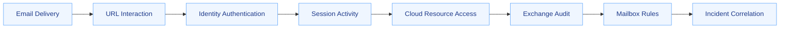

# 🛰️ VS-001 · Telemetry & Detection Coverage

> **Vertical Slice:** AiTM Token Theft → Mailbox Manipulation  
> **Purpose:** Map each behavior and transition to observable evidence and coverage  
> **Status:** Candidate mapping—product validation pending

[← Evidence Register](evidence.md) · [Back to VS-001](README.md)

---

## Core principle

> A technique may have a detection while the behavioral transition remains uncovered.

This document evaluates two different things:

1. **Behavior visibility** — can the individual action be observed?
2. **Sequence coverage** — can evidence from multiple stages be connected into one defensible investigation?

---

## Coverage scale

| State | Meaning |
|---|---|
| `FULL` | Reliable visibility and detection exist for the behavior and its required context |
| `PARTIAL` | Some relevant activity is detected, but important context or branches are missing |
| `WEAK` | Evidence exists but is noisy, indirect, incomplete, or difficult to operationalize |
| `NONE` | No known telemetry or detection currently covers the behavior |
| `UNKNOWN` | Coverage has not been validated |
| `NOT APPLICABLE` | The behavior does not apply to the reviewed environment |

---

## Telemetry layers



---

## Initial behavior-to-telemetry mapping

| Behavior | Candidate evidence | Example operations or signals | Validation |
|---|---|---|---|
| Phishing link delivered | Email-security and mail-flow telemetry | Message metadata, URL verdict, sender and routing context | Unknown |
| User opened link | URL-click, proxy, browser, or endpoint telemetry | Click event, navigation, destination reputation | Unknown |
| AiTM authentication | Identity and Defender XDR telemetry | AiTM-related authentication alert, sign-in context | Unknown |
| Session material stolen | Usually inferred from later use plus threat evidence | Session-cookie theft alert or campaign evidence | Unknown |
| Session reused | Identity/session-risk telemetry | Reused session, unusual device/browser/IP, no expected preceding authentication | Unknown |
| Microsoft 365 accessed | Cloud-app activity | Resource and session activity | Unknown |
| Mailbox accessed | Exchange/Purview audit | Mailbox access or item-access records | Unknown |
| Email collected | Mailbox item activity | `MailItemsAccessed`, search, sync, or high-volume access patterns | Unknown |
| Inbox rule created | Exchange/Purview audit | `New-InboxRule` | Unknown |
| Inbox rule modified | Exchange/Purview audit | `Set-InboxRule` | Unknown |
| Inbox rule removed | Exchange/Purview audit | `Remove-InboxRule` | Unknown |
| Email hidden or deleted | Mailbox activity and rule configuration | Move, delete, mark-as-read, suspicious folder target | Unknown |
| External forwarding enabled | Inbox rule, mailbox forwarding, or mail-flow configuration | Forwarding recipient or forwarding parameter | Unknown |

---

## Transition evidence

The graph must link behaviors through evidence, not merely place events beside each other.

### T-001 · Phishing link → AiTM authentication

**Potential join keys**

- user identity,
- message recipient,
- URL,
- click timestamp,
- device,
- IP address,
- browser session.

**Questions**

- Can the clicked URL be tied to the later authentication event?
- Is the destination confirmed as AiTM infrastructure?
- Could the authentication have occurred independently of the email?

**Coverage:** `UNKNOWN`

---

### T-002 · AiTM authentication → session material theft

**Potential evidence**

- Defender XDR AiTM-related alert,
- campaign infrastructure,
- proxied authentication behavior,
- later reuse of the same authenticated session.

**Challenge**

Session theft may not be directly visible. The transition may need to remain an inference supported by subsequent behavior.

**Coverage:** `UNKNOWN`

---

### T-003 · Session theft → session reuse

**Potential evidence**

- session identifier reuse,
- change in IP, device, browser, or geographic context,
- session activity without an expected new authentication,
- Defender alert for stolen-session use.

**Challenge**

A change in client context is suspicious but does not alone prove theft.

**Coverage:** `UNKNOWN`

---

### T-004 · Session reuse → mailbox access

**Potential join keys**

- user identity,
- session or correlation identifier,
- IP address,
- application,
- time window,
- user agent or client type.

**Questions**

- Can the cloud authentication and Exchange activity be linked to the same session?
- Which fields survive across the identity and mailbox telemetry?
- How much time can pass before correlation becomes unreliable?

**Coverage:** `UNKNOWN`

---

### T-005 · Mailbox access → email collection

**Potential evidence**

- item access records,
- unusual access volume,
- message searches,
- access to sensitive folders,
- browser or API activity.

**Challenge**

Normal user behavior can resemble collection. Baseline and context are essential.

**Coverage:** `UNKNOWN`

---

### T-006 · Mailbox access → inbox-rule manipulation

**Potential evidence**

- `New-InboxRule`,
- `Set-InboxRule`,
- `Remove-InboxRule`,
- forwarding configuration,
- suspicious delete, move, mark-as-read, or external-forward actions.

**Challenge**

Rule creation is common and legitimate. Malicious intent depends on rule conditions, actions, timing, identity context, and surrounding compromise evidence.

**Coverage:** `UNKNOWN`

---

## Initial coverage matrix

| Stage | Telemetry available | Detection available | Cross-stage correlation | Coverage |
|---|---|---|---|---|
| Phishing link delivery | Unknown | Unknown | Unknown | `UNKNOWN` |
| URL interaction | Unknown | Unknown | Unknown | `UNKNOWN` |
| AiTM authentication | Unknown | Unknown | Unknown | `UNKNOWN` |
| Session material theft | Unknown | Unknown | Unknown | `UNKNOWN` |
| Session reuse | Unknown | Unknown | Unknown | `UNKNOWN` |
| Microsoft 365 access | Unknown | Unknown | Unknown | `UNKNOWN` |
| Mailbox access | Unknown | Unknown | Unknown | `UNKNOWN` |
| Remote email collection | Unknown | Unknown | Unknown | `UNKNOWN` |
| Inbox-rule creation | Unknown | Unknown | Unknown | `UNKNOWN` |
| Email hiding/deletion | Unknown | Unknown | Unknown | `UNKNOWN` |
| Full behavioral chain | Fragmented | Unknown | Unknown | `UNKNOWN` |

---

## Detection coverage questions

### Email stage

- Can the message and malicious link be identified?
- Can the click be tied to the recipient and device?
- Does the email alert preserve the information needed for identity correlation?

### Identity stage

- Can suspicious session use be detected after successful MFA?
- Can the session be linked to the original authentication?
- Is device, browser, IP, and location context available?
- Which controls may block or invalidate the session?

### Exchange stage

- Is mailbox access visible?
- Are item-level access events available and retained?
- Are new or modified rules visible?
- Can external forwarding be distinguished from legitimate forwarding?
- Can hidden, delete, move, or mark-as-read actions be inspected?

### Correlation stage

- Can email, identity, session, and Exchange events be linked?
- Does the platform create one incident or several independent alerts?
- Are timestamps normalized?
- Are entity identifiers consistent?
- Which gaps force the investigator to search manually?

---

## Candidate investigation query

The first deterministic query should not start with natural language.

```python
investigate_session_reuse(
    identity="<user>",
    observed_at="<timestamp>",
    environment="microsoft_365",
    lookback="24h",
    lookforward="24h",
)
```

### Expected structured result

```json
{
  "observed_behavior": "session_reuse",
  "supported_successors": [],
  "alternative_hypotheses": [],
  "evidence_collected": [],
  "missing_telemetry": [],
  "coverage": {
    "identity": "UNKNOWN",
    "mailbox_access": "UNKNOWN",
    "email_collection": "UNKNOWN",
    "inbox_rule_activity": "UNKNOWN",
    "chain_correlation": "UNKNOWN"
  },
  "conclusion_status": "INSUFFICIENT_EVIDENCE"
}
```

The empty arrays are intentional until the evidence and detection mappings are validated.

---

## Coverage review template

```markdown
### Detection record DR-XXX

**Behavior:**  
**Product:**  
**Rule or alert:**  
**Data source:**  
**Required fields:**  
**Required licensing/configuration:**  
**Detection logic reviewed:** Yes / No  
**Known false-positive contexts:**  
**Correlates with previous stage:** Yes / No / Partial  
**Coverage state:** FULL / PARTIAL / WEAK / NONE / UNKNOWN  
**Evidence:**  
**Reviewer notes:**  
```

---

## Exit criteria

- [ ] Required log sources are verified against current product documentation.
- [ ] Required fields and operations are documented.
- [ ] Licensing, audit, and retention dependencies are visible.
- [ ] Benign explanations are recorded.
- [ ] Individual behavior coverage and transition coverage are separated.
- [ ] At least one end-to-end correlation query is tested.
- [ ] Missing telemetry is reported rather than silently treated as absence of attack.

---

## Navigation

[← Evidence Register](evidence.md) ·
[Back to VS-001](README.md) ·
[Practitioner Feedback →](feedback-log.md)
